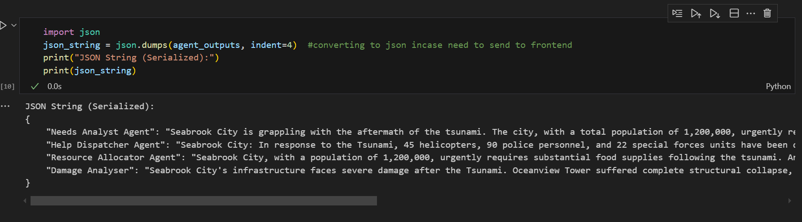
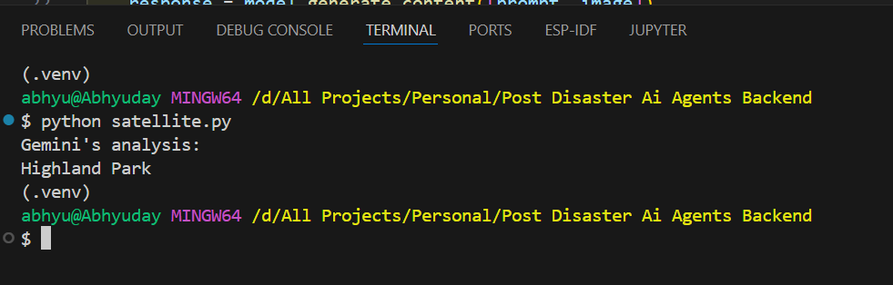

This is the output of an Agentic System using RAG to extract city-specific data:

JSON String (Serialized):
{
    "Needs Analyst Agent": "Seabrook City is grappling with the aftermath of the tsunami. The city, with a total population of 1,200,000, urgently requires food supplies, clothing, clean water, and medical supplies to address the immediate needs of its residents.",
    "Help Dispatcher Agent": "Seabrook City: In response to the Tsunami, 45 helicopters, 90 police personnel, and 22 special forces units have been dispatched to aid in rescue and relief efforts. Focus is on Oceanfront Plaza, Skyline Shop No. 11, and Wavecrest Apartments.",
    "Resource Allocator Agent": "Seabrook City, with a population of 1,200,000, urgently requires substantial food supplies following the tsunami. An estimated 3,600,000 apples, 2,400,000 bananas, and 1,200,000 oranges are needed to address the immediate needs of the affected population.",
    "Damage Analyser": "Seabrook City's infrastructure faces severe damage after the Tsunami. Oceanview Tower suffered complete structural collapse, and Eastside Pier is severely damaged, rendering it unsafe. Oceanfront Plaza, Skyline Shop No. 11, and Wavecrest Apartments require immediate attention due to trapped people."
}

This is the output of a dummy satellite image analysis, where AI identified the city affected by the disaster. This approach can be implemented to automatically extract the disaster-affected city directly from satellite images.

